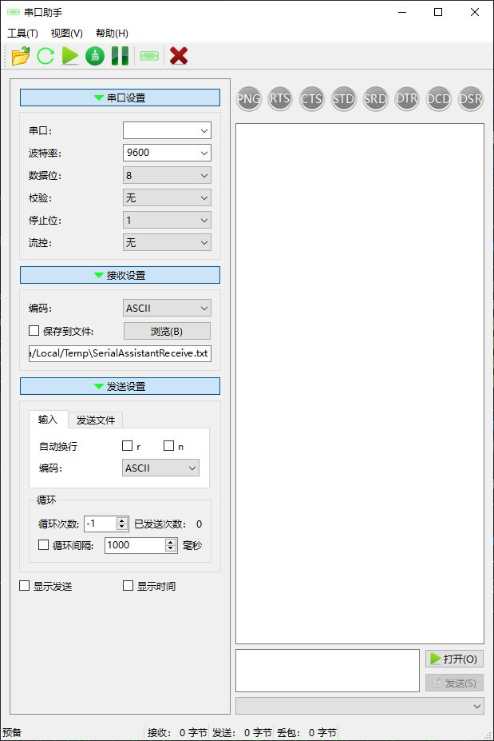
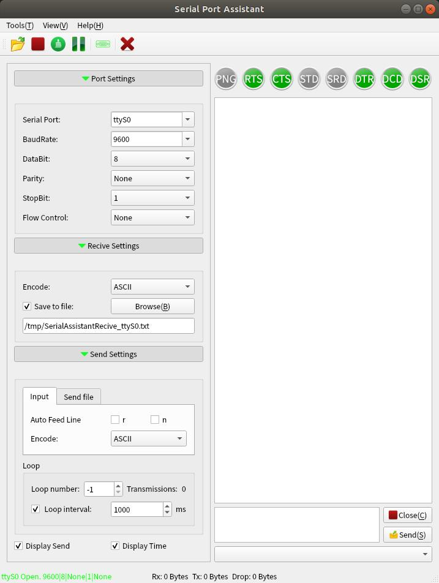

Serial Port Assistant
=====================

Author: Kang Lin (kl222@126.com)
--------------------------------

[Chinese](README_ZH.md)

1.   
This project is a cross-platform serial assistant. It can run on WINDOWS, linux system.

2. Complie status

    |Platform|Status|
    |:---:|:------:|
    |windows、android|[](https://ci.appveyor.com/project/KangLin/serialportassistant)|
    |linux|[](https://travis-ci.org/KangLin/SerialPortAssistant)|

3. Multi-language
    * Chinese  
    
    * Englisth  
    

4. Multi style

5.   


6. Donate  
If you are satisfied, you can donate to me
    * WeChat scan the following two-dimensional code for free donation  
    ")
    ")
    * Scan the following two-dimensional code to donate 20 yuan:  
    
    
7. Compile
    - Compiled with QtCreator
       * Open the project file  with QtCreator
       * Direct compilation can generate programs
    - Compile with the command line
       * Build the build directory in the project root directory
       * *qmake* build compilation project
       * *make* install Build the program with the local toolchain
       * The program is generated in the *install* directory

    ```sh
    mkdir build
    cd build
    qmake ../SerialPortAssistant.pro
    make install
    cd install  #The program is generated in the install directory
    ```
