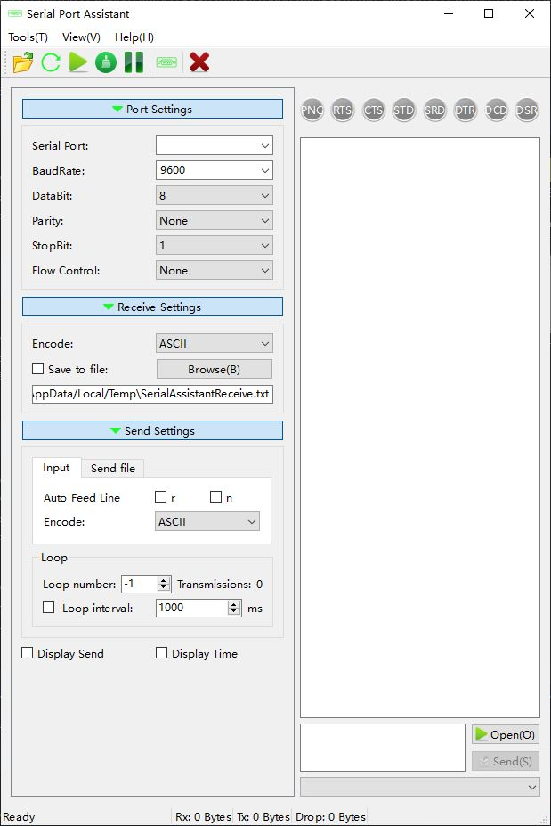

# Serial Port Assistant

Author: Kang Lin (kl222@126.com)

--------------------------------

[:cn: 中文](README_zh_CN.md)

--------------------------------

## Introduction
- Project position:
  + Main repository: https://github.com/KangLin/SerialPortAssistant
  + Mirrory repository:
    - https://gitlab.com/kl222/SerialPortAssistant
    - https://sourceforge.net/projects/serialportassistant/
    - https://gitee.com/kl222/SerialPortAssistant
    - https://bitbucket.org/kl222/serialportassistant
- [Project home](http://kanglin.github.io/SerialPortAssistant)
- This project is a cross-platform serial port assistant.
  It can run on:
  + [x] WINDOWS
  + [x] linux
  + [x] Android
  + [x] macOS  
    - macOS, I don't have the corresponding equipment,
    please compile and test the user with the corresponding equipment.
    - Currently compiles successfully.
    but the loading dynamic library path is not set correctly.
    Please help you set it.
    
  See: [Qt5 supported platforms](https://doc.qt.io/qt-5/supported-platforms.html), [Qt6 supported platforms](https://doc.qt.io/qt-6/supported-platforms.html).
- Multi-language
  + Chinese
  
    

  + Englisth

    

- Multi style

## Download

- 
- 
- 

## Donate

If you are satisfied, you can donate to me

 

If it cannot be displayed, please open:
- https://gitlab.com/kl222/RabbitCommon/-/raw/master/Src/Resource/image/Contribute.png
- https://sourceforge.net/p/rabbitcommon/code/ci/master/tree/Src/Resource/image/Contribute.png

## Developer  
### Dependence  

+ [Qt (LGPL v2.1)](http://qt.io/)
+ RabbitCommon: https://github.com/KangLin/RabbitCommon  
  It can be downloaded to the same directory of the project.
  If it is a different directory, set the environment variable `RabbitCommon_ROOT`

        git clone https://github.com/KangLin/RabbitCommon.git

### Compile  
  
- Download source code

        git clone https://github.com/KangLin/SerialPortAssistant.git

- Compiled with QtCreator
  + Open the project file [CMakeLists.txt](CMakeLists.txt) with QtCreator
  + The RabbitCommon can be downloaded to the same directory of the project.
    If it is a different directory, Set the parameter `RabbitCommon_ROOT`
  + Direct compilation can generate programs
- Compile with the command line
  + Download source code and the deplendence in same directory
  
        git clone https://github.com/KangLin/RabbitCommon.git
        git clone https://github.com/KangLin/SerialPortAssistant.git

  + Make the build directory in the project root directory

        cd SerialPortAssistant
        mkdir build
        cd build
        # cmake configure
        cmake .. -DCMAKE_BUILD_TYPE=Release -DCMAKE_INSTALL_PREFIX=`pwd`/install [-DRabbitCommon_ROOT=...]
        # compiling
        cmake --build . --config Release --target install
        cd install  # The program is installed in the install/bin directory

### Script

- build_debpackage.sh
  + This script generates the deb package under linux.
    Before use, please make sure the following programs are installed
  
        sudo apt-get install debhelper fakeroot build-essential cmake

  + Use system qt
    - qt6

          sudo apt-get install \
            qt6-tools-dev qt6-tools-dev-tools qt6-base-dev qt6-base-dev-tools \
            qt6-l10n-tools qt6-translations-l10n qt6-scxml-dev \
            qt6-webengine-dev qt6-webengine-dev-tools libqt6serialport6-dev

    See: [ubuntu.yml](.github/workflows/ubuntu.yml)
    - qt5
    
          sudo apt-get install qttools5-dev qttools5-dev-tools \
              qtbase5-dev qtbase5-dev-tools qttranslations5-l10n \
              libqt5scxml5-dev libqt5svg5-dev libqt5serialport5-dev \
              qtwebengine5-dev qtwebengine5-dev-tools qtwebengine5-private-dev

- build_appimage.sh

  build AppImage. See: https://github.com/linuxdeploy/linuxdeploy/

- deploy.sh: This script is used to generate new release version numbers and tag.
  Used only by the program publisher.

#### Test

- Ubuntu
  - Install `socat`

        $ sudo apt update
        $ sudo apt install socat

  - Create a pair of virtual serial ports

        $ sudo socat -d -d pty,raw,echo=0 pty,raw,echo=0

    - After running, it will display:

          2025/12/03 14:09:27 socat[31902] N PTY is /dev/pts/5
          2025/12/03 14:09:27 socat[31902] N PTY is /dev/pts/6
          2025/12/03 14:09:27 socat[31902] N starting data transfer loop with FDs [5,5] and [7,7]

    - Create symbolic links (optional, for better naming).

          $ sudo ln -sf /dev/pts/2 /dev/ttyVCOM0
          $ sudo ln -sf /dev/pts/3 /dev/ttyVCOM1

    - The above two steps can be combined into the following command.

          $ sudo socat -d -d pty,link=/dev/ttyVCOM0,raw,echo=0 pty,link=/dev/ttyVCOM1,raw,echo=0 

  - You can now use this program to open the serial port. `/dev/pts/5`(/dev/ttyVCOM0) and　`/dev/pts/6`(/dev/ttyVCOM1).  
    Because these serial port names are non-standard, this program cannot find them.
    You can enter the following in the "Serial Port" field: `/dev/pts/5`  
    Because the virtual serial port was created with root privileges, this program also needs to be run with root privileges.

        $ sudo serialportassistant

    Alternatively, authorize the serial port to the current user:

        $ sudo chown $USER:tty /dev/pts/5
        $ sudo chown $USER:tty /dev/pts/6
        $ serialportassistant
